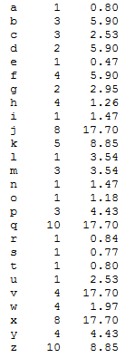

## Programming Project: Letter Frequencies in Scrabble

The board game Scrabble works by assigning points to wooden tiles that are marked with printed letters, and are arranged as interlocking words on a Scrabble board. It's described here: Scrabble.

In Scrabble point assignment roughly reflects a letter's frequency in English text. (A letter's frequency is the number of times it occurs in a sample of text). Thus the most common letters 'e' and 'a' both have the Scrabble value 1, whereas 'b' has the value 3 and 'z', among the rarest letters, has the value 10.

Here is the a to z list of Scrabble letter scores:

```
A	B	C	D	E	F	G
1	3	3	2	1	4	2

H	I	J	K	L	M	N	O
4	1	8	5	1	3	1	1

P	Q	R	S	T	U	V
3	10	1	1	1	1	4

W	X	Y	Z
4	8	4	10
```

How accurate are these values? For this assignment your job is to read from an external text file, calculate the letter frequencies in the text, and then produce a table that displays each letter, its Scrabble score, and then its relative frequency in the text compared to the average frequency of the letters with Scrabble score 1.

For example, suppose you read in the following text, which is in a text file called pears.txt:

```
"OK, nothings perfect, but, so far, the
 buzz is that Harrow Sweet comes as
 close as any pear I grow. It is very
 extra sweet, which in our more
 northern latitude can be a major issue
 where pears often get inadequate
 sugar. The Highlands are as sweet as
 Seckels this year- the sweetest pear
 commonly grown here."
```

Here is the output produced:



## Relative frequency calculations

The third column in the table you are to print - work this way. First, the average frequency in the text for the 10 letters with a Scrabble score of 1 (call this value avgOne) is computed. (The letters with a Scrabble score of 1 are: a, e, i, l, n, o, r, s, t, u). In Pears.txt there are 177 letters with score 1, so avgOne = 17.7. Then, for each letter ch, avgOne is divided by the number of occurences of ch in the text. The letter 'w' occurs 9 times in this text file, so the 'w' row of the table reports the value 1.97, that is, (17.7/9).

What does the table show? Look at the row for 'j', above. Its Scrabble score - 8 - suggests that j is 8 times less likely to occur in a text than the average letter scoring 1. But in fact in Pears.txt j's frequency is only about 1/18 that of the most common letters. Pears.txt is a small sample of English text, and so letter frequencies only very roughly approximate the true letter frequencies in English in general usage, but this example, and other larger texts, show that Scrabble letter scores are only very coarse approximations of the true frequency values.

To summarize, for a given text file your program should print results as above: a table with a typical row consisting of a letter, say w, its Scrabble score - for w, 4, and its frequency relative to avgOne, 1.97. Each row must be formatted as follows: the letter, then five spaces, then the scrabble score, then four spaces, then the relative frequency displayed to two decimal place precision. Note that there are four spaces between the letter and its Scrabble score if the Scrabble score is a two digit integer, and there are three spaces between the Scrabble score and the relative frequency if there are two integer digits in the relative frequency. This formatting is easily done with [printf statements](https://docs.oracle.com/javase/tutorial/java/data/numberformat.html).

You are provided the driver class, ScrabbleDriver.java, and a file to help you process an external text file ScrabblePrecision.java

Your job, then is to write the ScrabblePrecision class so that ScrabbleDriver works properly.

## Other Requirements and Observations

- Go to the [Project Guttenberg](https://www.gutenberg.org/) and download at least 3 other txt files to test your code. Be sure to add the txt files and a screenshot of your output to your respository

- The ScrabblePrecision class extends the TextAccessor class given above. You should not modify TextAccesor

- Your code must make use of getOnesAverage which returns the average frequency value in the supplied text for the letters that have Scrabble score 1.

- Your code must make use of the method getLetterPos. When letterPos is passed a (lower case) letter ch, it should return the letter's numerical position in the letter list (so getLetterPos('a') should return 0; getLetterPos('c') should return 2, and getLetterPos('z') should return 25). [Note: it's a good idea to convert each line to lower case before you do any processing].

- Your output should be formatted using the [printf method](https://docs.oracle.com/javase/tutorial/java/data/numberformat.html); the values that reflect a letter's frequency when compared to avgOne should be displayed with two-decimal-place accuracy, as indicated above.

- **NOTE:** You may not use an ArrayList.

- You need to comment your methods according to this [Javadoc Guide](https://github.com/jd12/liferay-portal/blob/master/readme/ADVANCED_JAVADOC_GUIDELINES.markdown).
